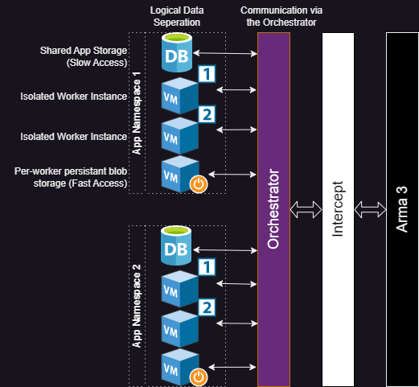
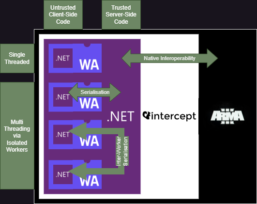
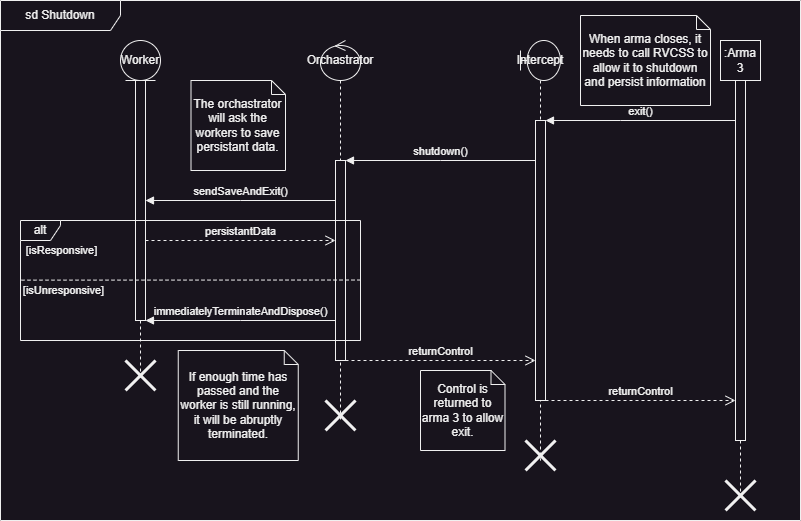
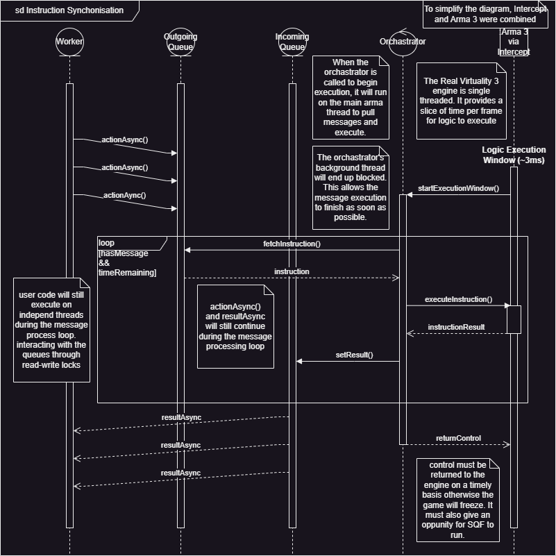

# IsolatedCodeHosting
Built on top of [@SteveSandersonMS's DotNetIsolator](https://github.com/SteveSandersonMS/DotNetIsolator) (For now) 
Provides additional features such as async await.  
And a temporary custom version of Delay(Timespan delay).  

## Why weird and custom systems?
Threads are not available. Therefore, the Task-based Asynchronous Pattern is implemented with a shared async state machine.  
The state machine is enumerated by having the Wasm host call into the Wasm app.  
If the host does not repeatably call into the app, tasks will not be processed.  
The temporary replacement for `Task.Delay` works similarly to this.  

## Next Steps
Find a suitable replacement or fix for Timers.  
Fixing Timers will allow the regular `Task.Delay` method to work and other .NET features.  

## Planned System Architecture
### Logical Data Separation

### Communication Across API Boundaries

### Startup Sequence Diagram

### Shutdown Sequence Diagram

### Instruction Synchronization Sequence Diagram

